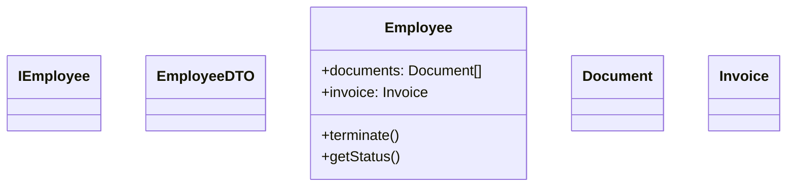
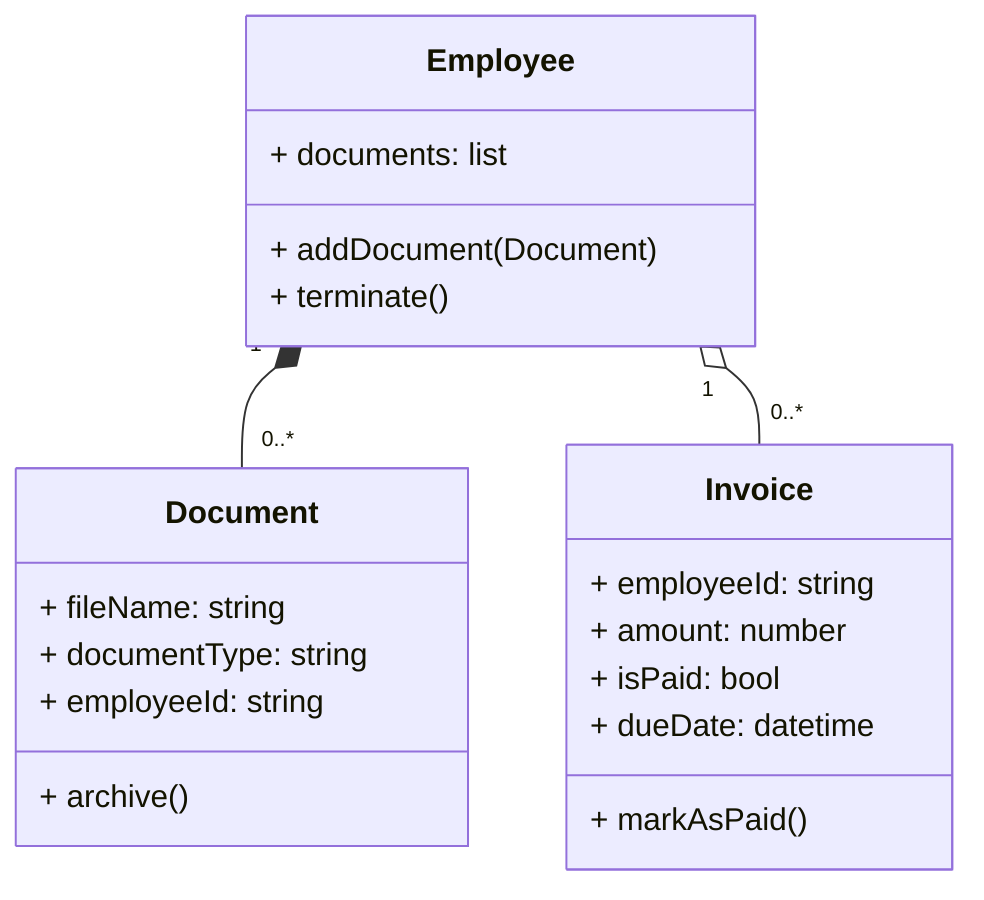

# Architecture Legend

**1. System Context & Syntax Standard**
* This document is the absolute source of truth for translating repository source code into architectural schematics.
* **Syntax Standard:** `Mermaid.js`.
* **Diagram Types:** * Use `classDiagram` strictly for static Domain Models.
  * Use `flowchart TD` strictly for behavioral Flow Diagrams.

**2. Pruning Rules**
* To prevent overcomplicating diagrams, you must strictly evaluate every file and class in the provided context. **You must actively follow these rules:**
* **Inheritance, Interfaces & Abstractions:** Ignore all inheritance hierarchies. Do not map `extends` or `implements`. Exclude all abstract classes and interfaces entirely. Map only the concrete implementation classes that hold actual state/data. **CRITICAL:** When an abstract base class is excluded, also exclude all attributes and methods inherited from it. Show ONLY members that are directly declared in each concrete class, not inherited ones.
* **Strict Class Exclusion (Name-Based Pruning):** You MUST exclude any class whose name ends with any of the following suffixes: `Controller`, `Handler`, `Repository`, `Factory`, `Mapper`, `DTO`, `ViewModel`, `Wrapper`, `Service` or `Util`. Do not evaluate their internal logic; if the name matches, exclude it.
* **Strict Method Inclusion (CRITICAL):** Include ONLY `public` methods that mutate state or perform business logic. You must explicitly exclude any method whose name begins with `get`, `set`, `is`, `has`, `build`, or standard lifecycle hooks (e.g., `ngOnInit`, `__init__`).

**3. Entity & Naming Standards (Domain Models)**
* **What to Include:** **Domain Entities (`class`):** Extract classes that represent primary domain concepts, persistent data entities, or stateful business records.
* **Inference Rules:** Look for classes that possess data fields/properties representing business state, or classes decorated with persistence/domain annotations (e.g., @Entity, @Table, @Document).
* **Naming Convention for Classes:** Use `PascalCase` with no spaces. Strip framework-specific suffixes (e.g., extract `UserServiceImpl` simply as `User`).
* **Attribute Formatting:** Strictly format class attributes using standard UML notation: `[visibility] name: type`.
  * **Naming:** You MUST convert all attribute names to `camelCase` (e.g., `employeeId`, NOT `employee_id`).
  * **Typing:** Do NOT use language-specific type declarations (e.g., use `map` or `list` instead of `Dict` or `List<T>`).
* **Method Formatting:** Strictly format methods using exact UML shorthand. Do NOT use raw code signatures.
  * **Visibility:** Always start with a `+` (public), `-` (private), or `#` (protected).
  * **Naming Methods:** Convert all method names to `camelCase` (e.g., `updateStatus`, NOT `update_status`).
  * **Arguments:** Inside parentheses, list ONLY the data types. Do not include the variable names (e.g., `(Document, string)`, NOT `(doc: Document, new_status: string)`).
  * **Return Types:** Use a single colon followed by the type. If the method returns nothing/void, omit the return type entirely. Never use double colons (`::`).
  * **Examples:** `+ addDocument(Document)`, `+ validate(): bool`

**4. Relation Mapping (Strict Operators)**
When mapping relationships between concrete classes in a `classDiagram`, you must use exactly one of the following Mermaid operators:
* **Composition (`*--`):** Strict lifecycle dependency. Use when Class A instantiates and strictly owns Class B. (If A is deleted, B is destroyed).
* **Aggregation (`o--`):** Independent reference. Use when Class A holds a collection or reference to Class B, but Class B has an independent lifecycle.
* **Directed Association (`-->`):** Temporary usage/Method call. Use when Class A calls a method on Class B, but does not store Class B as a persistent attribute.
* **Inferring from Foreign Keys:** If a class contains a property that references another class's ID (e.g., an `Invoice` containing `employee_id`), you MUST infer a structural relationship between them. Connect the parent to the child using Composition or Aggregation.

**5. Cardinality Definitions**
You must explicitly define relationship cardinality by placing the exact multiplicity string in quotes (e.g., ClassA `"1"` `*--` `"0..*"` ClassB). Infer cardinality strictly from the codebase's data types:
* **One-to-One / One-to-Many (Parent side):** Always assume "1" on the parent side of the relationship unless the code explicitly defines a collection of parents.
* **One-to-One (Child side):** If the field is a single object reference (e.g., invoice: Invoice), infer `"1"` or `"0..1"`.
* **One-to-Many (Child side):** If the field is an array or collection type (e.g., documents: Document[], List<Invoice>, Set<User>), infer `"0..*"` or `"1..*"`.

**6. Flow Diagrams (Algorithmic & Execution Logic)**
When tasked with mapping the execution flow of a specific process or service, strictly map the codebase's logic using `flowchart TD`.
* **Pruning:** Exclude variable declarations, standard logging, and simple data formatting. Include conditional branching (`if/else`, `try-catch`, `switch`), loops, Database I/O, and cross-service invocations.
* **Node Mapping:**
  * **Process Node (`[ ]`):** Use standard rectangles for internal computations (e.g., `A[Calculate Benefit Eligibility]`).
  * **Decision Node (`{ }`):** Use diamonds strictly for control flow statements (`if`, `try-catch`, `switch`). The text inside must be a question (e.g., `B{Is Employee Full-Time?}`).
  * **Database/Storage Node (`[( )]`):** Use cylinders strictly for code that reads/writes to storage (e.g., `C[(Save to Employee Table)]`).
  * **Terminal Node (`([ ])`):** Use pill shapes strictly for the entry point (e.g., `([Start: processTermination])`) and exit/return states, including throwing business exceptions (e.g., `([Throw Validation Error])`).
  * **Edge Routing:** Use `-->` for sequential execution. Any edge exiting a Decision Node (`{ }`) MUST include a text label defining the branch condition (e.g., `-->|Yes|`).
  * **Loops:** Represent all loops explicitly with Process Nodes for iteration and Decision Nodes for conditions/continuation. Do NOT collapse loops into single action nodes. Include nested `if` conditions within loops as Decision Nodes within the loop construct.

**7. Canonical Examples (Domain Model)**
Use the following example to calibrate your output.

**Source Code (Python):**
```python
from abc import ABC, abstractmethod
from typing import List

class IEmployee(ABC):
    id: str
    name: str

class EmployeeDTO:
    def __init__(self):
        self.id: str
        self.name: str

class Document:
    def __init__(self):
        self.id: str

class Invoice:
    def __init__(self):
        self.id: str
        self.employee_id: str  # if there is a foreign key -> infer aggregation

class Employee(IEmployee):
    def __init__(self):
        self.id: str
        self.documents: List[Document]  # Composition, Array -> 0..*
        self.invoice: Invoice           # Aggregation, Single Ref -> 1

    def terminate(self) -> None:
        pass

    def get_status(self) -> str:
        return "ACTIVE"
```

**❌ INCORRECT Output:**
*(Fails to prune Interfaces/DTOs/Getters, fails to map relationships from fields)*


**✅ CORRECT Output:**
*(Properly prunes noise, infers cardinality from arrays vs. single references, extracts relationships, shows only directly declared members)*


**Note on Inherited Members:** The `id`, `createdAt`, and `updatedAt` attributes (inherited from the excluded `BaseEntity` and `IEmployee`) are NOT shown. Only attributes and methods directly declared in each concrete class are included.
