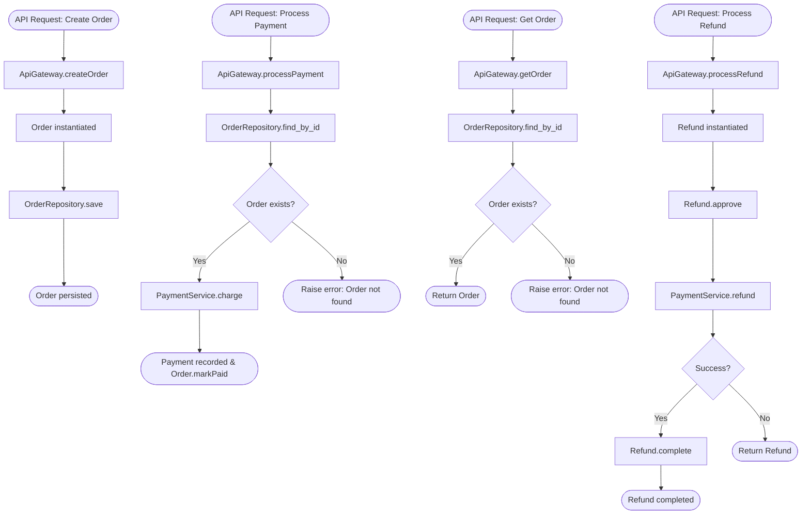

# Architecture Flow: API Gateway Process

**Generated on:** April 28, 2026

**Source Scope:** `src/api_gateway.py`

## Mermaid Diagram

## Flow Description

This diagram depicts the primary API Gateway flows:
- Order creation, processing, and storage; payment processing after order validation; retrieval and error handling for non-existent orders; and handling of refund requests involving refund approval, payment service interaction, and status updates.
