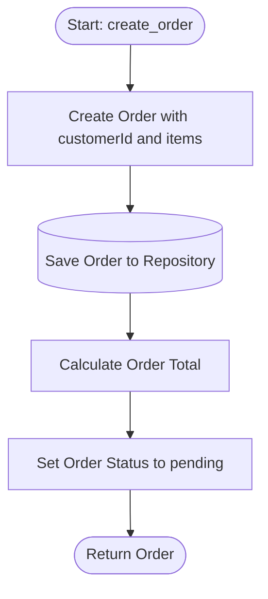

# Architecture Flow: Order Creation

**Generated on:** April 28, 2026

**Source Scope:** `src/api_gateway.py`, `src/models.py`, `src/order_repository.py`

## Mermaid Diagram

## Process Dictionary

* **Start: create_order:** Entry point invoked when a client requests creation of a new order, supplying customer and item details.
* **Create Order with customerId and items:** Instantiate new `Order` domain entity (or subtype), assign a unique orderId, initialize with 'pending' status.
* **Save Order to Repository:** Persist order data using repository pattern.
* **Calculate Order Total:** Sum all line item subtotals and any special fees (e.g., PriorityOrder or VIPOrder surcharge).
* **Set Order Status to pending:** Ensure order's initial state is pending payment.
* **Return Order:** Provide resulting order (with all data populated) to the API client.
