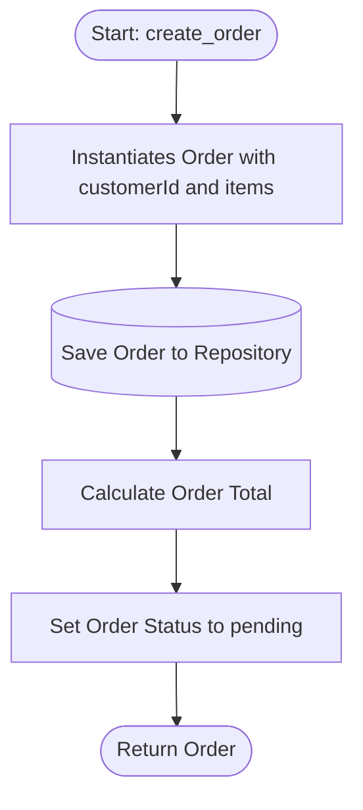

# Architecture Flow: Order Creation

**Generated on:** April 28, 2026

**Source Scope:** `src`

## Mermaid Diagram

## Flow Description

* **Start: create_order:** Entry point for order creation workflow, accepting customerId and items as input.

* **Instantiates Order with customerId and items:** Creates Order entity, initializing orderId, status, and item list.

* **Save Order to Repository:** Persists Order in the in-memory repository using OrderRepository.save.

* **Calculate Order Total:** Computes the order total by iterating items and summing price × quantity for all entries.

* **Set Order Status to pending:** Ensures the Order status is set to 'pending' until payment is processed.

* **Return Order:** Returns the newly created Order entity with full data to the API caller.
