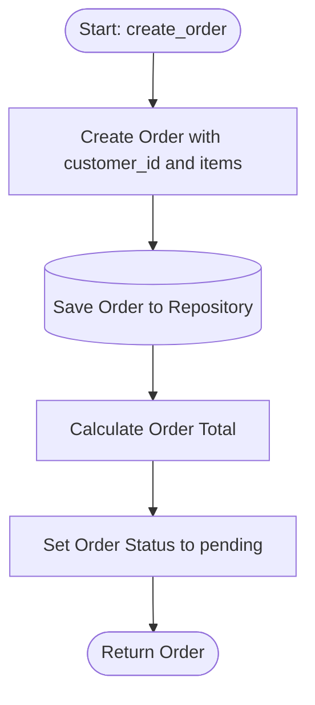

# Architecture Flow: Order Creation

**Generated on:** April 28, 2026
**Source Scope:** `/src/api_gateway.py`, `/src/models.py`, `/src/order_repository.py`

## Mermaid Diagram

## Process Dictionary

* **Start: create_order:** Entry point when API client requests a new order with customer identifier and line items.

* **Create Order with customer_id and items:** Instantiate new Order domain entity with provided parameters. Auto-generate unique orderId and initialize status as 'pending'.

* **Save Order to Repository:** Persist Order instance to in-memory repository storage via `OrderRepository.save()`.

* **Calculate Order Total:** Invoke `Order.calculateTotal()` to compute sum of all line items. Total = Σ(item.price × item.qty).

* **Set Order Status to pending:** Confirm Order status remains 'pending' until payment is processed.

* **Return Order:** Send Order instance back to client with all computed fields populated.
