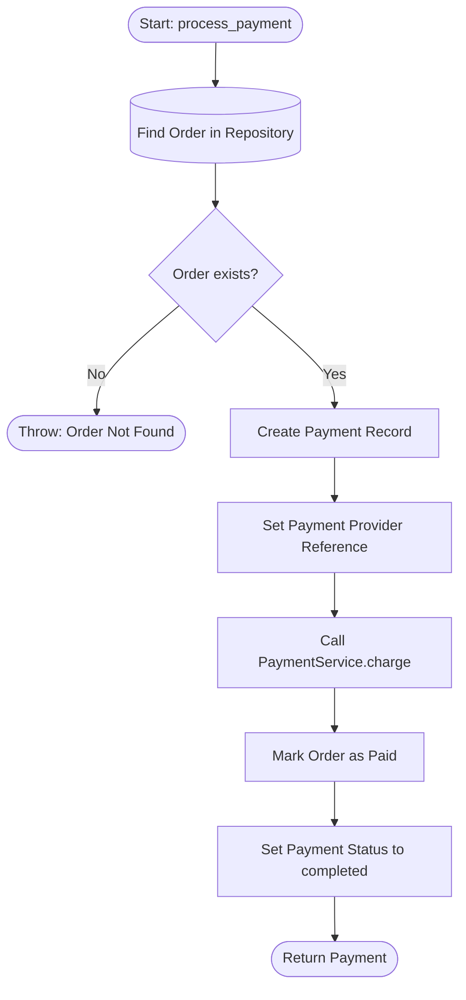

# Architecture Flow: Payment Processing

**Generated on:** April 28, 2026

**Source Scope:** `src/api_gateway.py`, `src/payment_service.py`, `src/models.py`, `src/order_repository.py`

## Mermaid Diagram

## Process Dictionary

* **Start: process_payment:** Entry to begin payment for an order.
* **Find Order in Repository:** Retrieve order record for charging.
* **Order exists?:** Decision if order lookup succeeds.
* **Throw: Order Not Found:** Ends flow if order is missing.
* **Create Payment Record:** Establish Payment entity and related data.
* **Set Payment Provider Reference:** Set provider-specific ref for the payment.
* **Call PaymentService.charge:** Interact with payment provider to process payment.
* **Mark Order as Paid:** Update Order status after payment success.
* **Set Payment Status to completed:** Reflect payment completed status in system.
* **Return Payment:** Output payment receipt and details.
