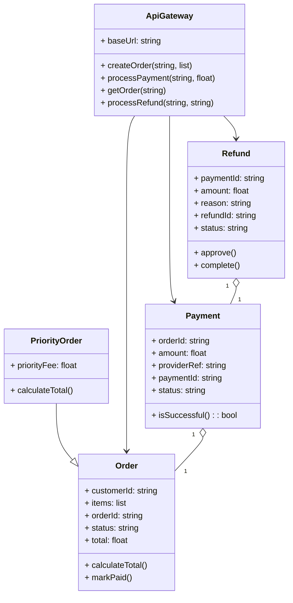

# Architecture Model: Domain

**Generated on:** April 28, 2026

**Source Scope:** `src`

## Mermaid Diagram

## Entity Dictionary

* **ApiGateway:** Aggregates business logic for orders, payments, and refunds; exposes facade for external callers.
* **Order:** Represents a customer order, tracks purchased items, total, status, and unique orderId.
* **PriorityOrder:** Specialized Order with additional priorityFee and an overridden total calculation.
* **Payment:** Tracks completion and provider reference of a payment for an order; determines success state.
* **Refund:** Manages refund approvals and completion for a payment, containing reason and unique refundId.
