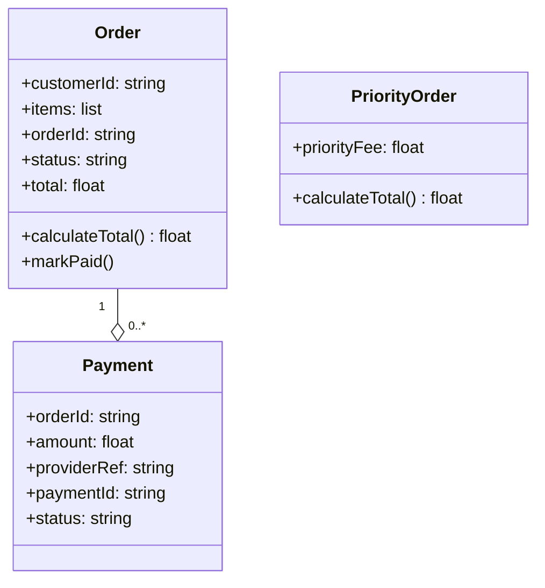

# Architecture Model: Order Management Domain

**Generated on:** April 28, 2026
**Source Scope:** `/src`

## Mermaid Diagram

## Entity Dictionary

* **Order:** Primary domain entity representing a customer order. Maintains order state (pending/paid), item list, and calculated total. Responsible for computing total price and marking payment status.

* **PriorityOrder:** Specialization of Order with premium handling. Adds a priority fee to the base order total. Overrides total calculation logic to include priority surcharge.

* **Payment:** Domain entity representing a payment transaction for an order. Stores payment provider reference, amount, and transaction status. Used to track payment completion and support refund operations.

## Relationship Notes

* **Order → Payment (Aggregation, 1..*):** One Order can have multiple associated Payments (e.g., partial payments, failed attempts). Payment maintains reference to Order via `orderId` field. Order lifecycle is independent of Payment.
