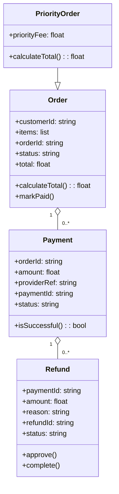

# Architecture Model: Domain

**Generated on:** April 28, 2026

**Source Scope:** `src`

## Mermaid Diagram

## Entity Dictionary

* **Order:** Represents a customer order containing information on customer identifier, items, and order state. Calculates total and tracks payment status.
* **PriorityOrder:** Special order type with priority fee and custom total calculation logic.
* **Payment:** Represents a payment transaction linked to an order, including provider details and transaction status.
* **Refund:** Represents a refund transaction tied to a payment, tracking reason and refund process status.
