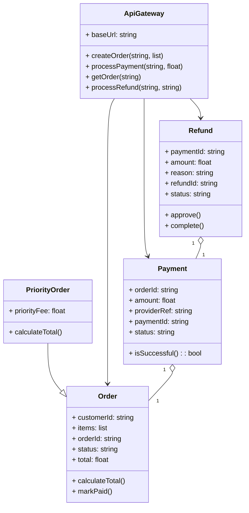

# Architecture Model: Domain

**Generated on:** April 28, 2026

**Source Scope:** `src`

## Mermaid Diagram

## Entity Dictionary

* **ApiGateway:** Facade for order/payment/refund flow coordination, delegates actions to lower-level services and repositories.
* **Order:** Customer order holding order state, items, and calculation logic.
* **PriorityOrder:** Specialized Order with an additional priority fee and override for total calculation.
* **Payment:** Represents a monetary operation against an order with provider references and status evaluation.
* **Refund:** Represents a refund operation associated to a Payment, containing approval/completion logic.
