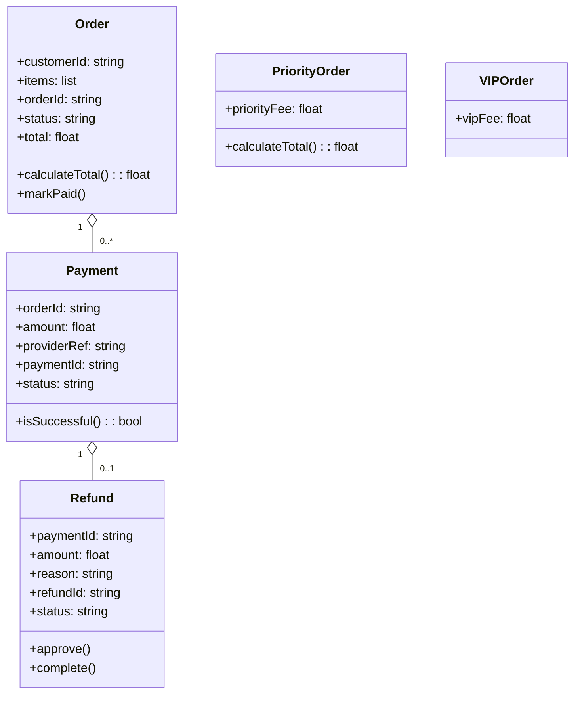

# Architecture Model: Domain

**Generated on:** April 28, 2026

**Source Scope:** `src`

## Mermaid Diagram

## Entity Dictionary

* **Order:** Represents a customer purchase containing multiple items, unique orderId, payment status, and logic for total calculation and status changes.  
* **PriorityOrder:** A type of Order with an additional priority fee, overriding total calculation logic.  
* **VIPOrder:** Special Order subtype for VIP customers, includes an extra vipFee attribute for premium purchases.  
* **Payment:** Records a monetary transaction for a specific order, with references to provider, status, and logic to verify successful completion.  
* **Refund:** Captures refund actions for a payment, references paymentId, amount, reason, and methods for approving or completing a refund process.
