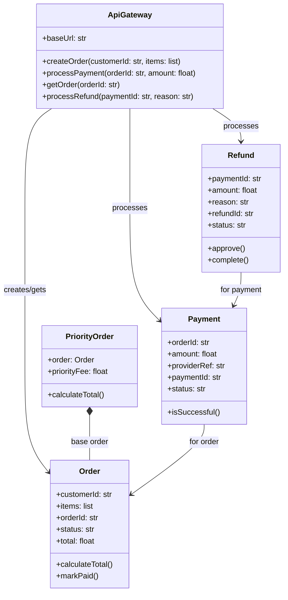

# Architecture Model: Domain

**Generated on:** April 28, 2026

**Source Scope:** `src`

## Mermaid Diagram

## Entity Dictionary

* **ApiGateway:** Main access point for API actions, orchestrates order, payment and refund flows.
* **Order:** Aggregate root for a purchase; tracks customer, items, total, and status.
* **PriorityOrder:** Decorates an Order with priority processing and extra fee.
* **Payment:** Represents a payment transaction for an order with status and external reference.
* **Refund:** Represents a refund transaction tied to a payment, with status control.
