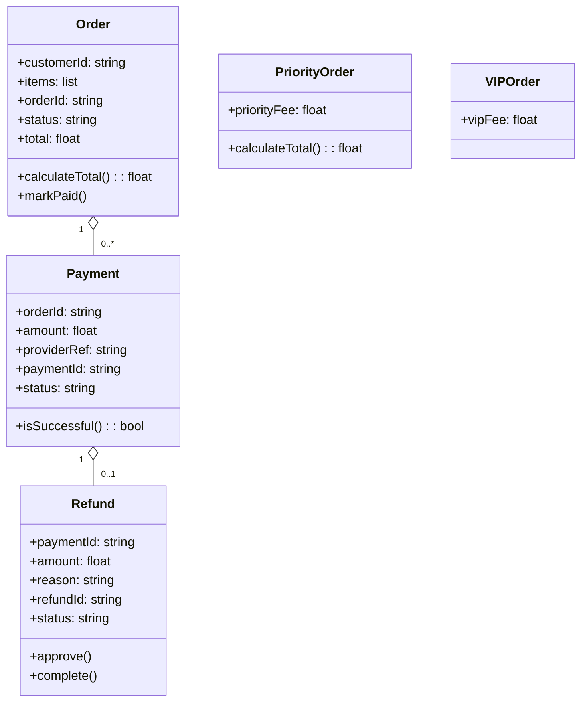

# Architecture Model: Domain

**Generated on:** April 28, 2026

**Source Scope:** `src`

## Mermaid Diagram

## Entity Dictionary

* **Order:** Represents an individual customer purchase with associated items, status, and total computation logic. Can be marked as 'paid' upon successful payment.
* **PriorityOrder:** Specialized Order with additional fee for expedited processing. Overrides total calculation to include priority fee.
* **VIPOrder:** Enhanced type of order specifically for VIP customers; applies an extra vipFee charge.
* **Payment:** Represents a payment transaction for an order, including references to the payment provider, amount, and transaction status. Can check if payment has completed successfully.
* **Refund:** Tracks refund attempts or completions for a specific payment, including amount, reason for refund, and processing status. Has logic for approval and completion steps.
