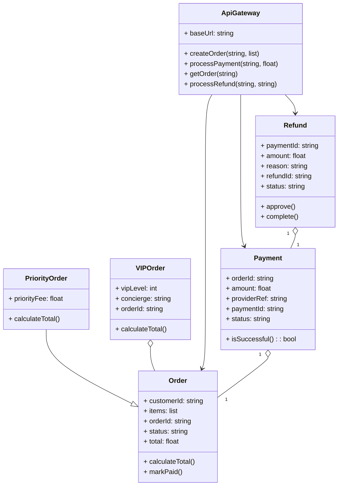

# Architecture Model: Domain

**Generated on:** April 28, 2026

**Source Scope:** `src`

## Mermaid Diagram

## Entity Dictionary

* **ApiGateway:** Serves as the primary facade for all order, payment, and refund processes. It coordinates requests and delegates underlying logic to proper services and repositories.
* **Order:** Represents a customer's purchase order, maintaining purchased items, status, and total value calculation logic.
* **PriorityOrder:** Subclass of Order that adds a priority fee and customizes total calculation.
* **VIPOrder:** Distinct order variant associated with an existing Order (aggregation), holds VIP-specific details and custom total calculation.
* **Payment:** Records payment transactions for an order, holding amount, external provider info, and current status. Includes a method to determine if payment was successful.
* **Refund:** Details refund operations tied to a specific payment, holding refund status, amount, and business logic for approval and completion.
