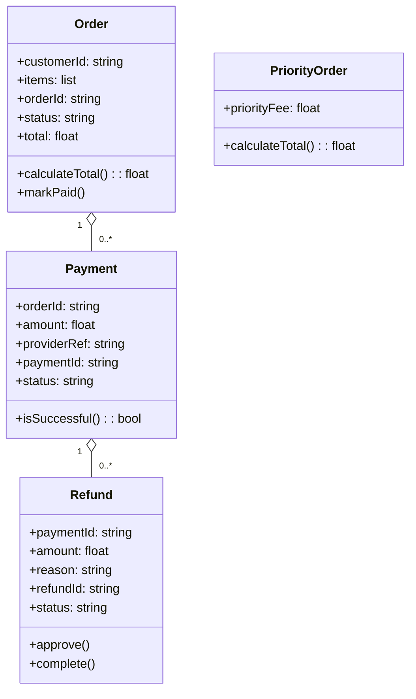

# Architecture Model: Domain

**Generated on:** April 28, 2026

**Source Scope:** `src`

## Mermaid Diagram

## Entity Dictionary

* **Order:** Represents a customer order containing items, customer ID, unique order ID, order status, and total price. Responsible for calculating totals and updating payment status.

* **PriorityOrder:** Specialized version of Order with a priority fee, altering total price calculation.

* **Payment:** Represents a payment transaction with reference to an order, amount charged, payment provider reference, unique payment ID, and status. Can determine payment success.

* **Refund:** Domain entity tracking refund transactions for a specific payment, including amount, reason, and status. Supports approval and completion lifecycle steps.
