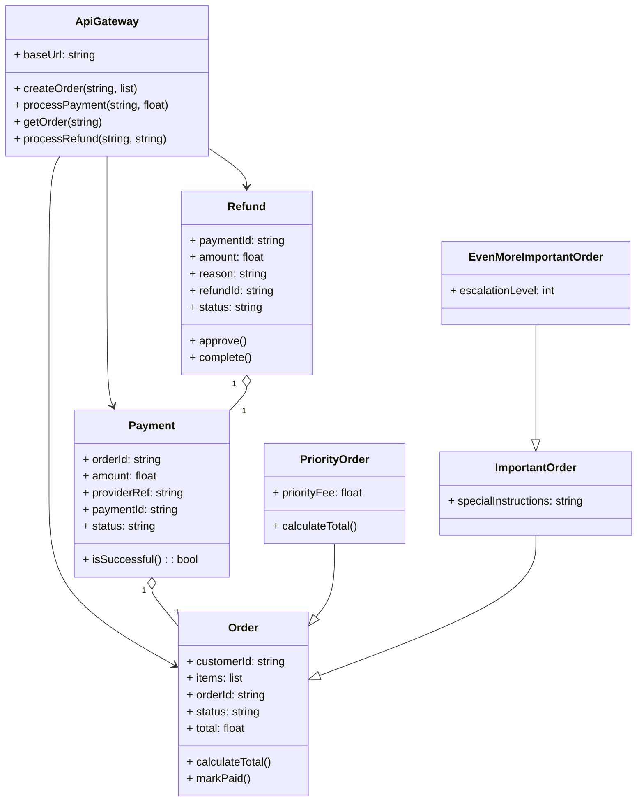

# Architecture Model: Domain

**Generated on:** April 28, 2026

**Source Scope:** `src`

## Mermaid Diagram

## Entity Dictionary

* **ApiGateway:** Serves as the primary facade for all order, payment, and refund processes. Coordinates requests and delegates underlying logic to appropriate internal logic and models.
* **Order:** Represents a customer's purchase order, maintaining purchased items, identifiers, status, and total value calculation logic.
* **PriorityOrder:** An extension of Order for rush purchases, adding a priority fee and overriding total calculation.
* **ImportantOrder:** Inherits from Order, representing high-importance orders and typically holding special instructions.
* **EvenMoreImportantOrder:** Inherits from ImportantOrder, modeling top-priority orders with escalation levels.
* **Payment:** Records payment transactions for an order, holding amount, external provider info, and current status. Includes a method to determine if payment was successful.
* **Refund:** Details refund operations tied to a specific payment, holding refund status, amount, and business logic for approval and completion.
